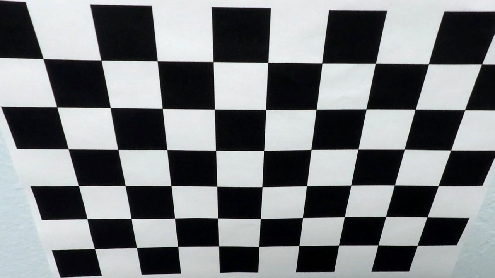

## Advanced Lane Finding
[](http://www.udacity.com/drive)

This is the Advanced lane Finding project submitted to the Udacity.  

# Synopsis

The aim of this project is to find and plot the lanes as well as to find the distance of the vehicle from the lane center.    

# Pipeline


1. Camera calibration
2. Rectification of raw/distorted images
3. Finding lanes
4. Drawing lane markings on to the image

### Camera Calibration

The raw images from the cameras are distorted that it has to be rectified. in order to rectiofy raw images, the camera calibration matrix and distortion coefficient has to be found.   

On the given set of calibration images the **cv2.findChessboardCorners** function is used to find the chessboard corners and **cv2.calibrateCamera** is used to find the camera calibration matrix and distortion coefficient.  


`````
img_gray =cv2.cvtColor(img, cv2.COLOR_BGR2GRAY)
                
ret, corners = cv2.findChessboardCorners(img_gray, (corners_horizontal, corners_vertical), None)

`````
and 

``````
ret, mtx, dist, rvecs, tvecs = cv2.calibrateCamera(objpoints, imgpoints, (img.shape[1], img.shape[0]), None, None)

``````

For visualization purposes the **cv2.drawChessboardCorners** is used.  


### Rectification of raw/distorted images

The calculated camera calibration matrix and distortion coefficient are used in the opencv function **cv2.undistort** is used to undistort the raw images.  




### Finding lanes

The section **pipeline** is used to find the lanes and curvature. 

Before finding the lanes some preprocessing of images might help to detect the lanes better.  

#### Reading image
The raw image is read using the matplotlib. The opencv image read function is not used as it reads images in BGR color order instead of RGB which reasult in additional process of converting from BGR to RGB color space. 


> import matplotlib.image as mpimg

#### Undistort

After reading the image the image is undistorted using **cv2.undistort**, then preprocessing is done to get a buínary image.  


#### Applying Filtering

**Preprocessing:** The image is converted into HSV color space as the HSV color space is relatively unafffected by shadows and then the yellow and white lanes are filtered as most of the lanes are either white or yellow.    


``````
def preprocess_image(image, verbose):
    hsv = cv2.cvtColor(image, cv2.COLOR_RGB2HSV)
    yellow_lower = np.array([20,60,60])
    yellow_upper = np.array([38,174, 250])
    yellow_mask = cv2.inRange(hsv, yellow_lower, yellow_upper)
    
    white_lower = np.array([202,202,202])
    white_upper = np.array([255,255,255])
    white_mask = cv2.inRange(image, white_lower, white_upper)
    
    combined_binary = np.zeros_like(yellow_mask)
    combined_binary[(yellow_mask >= 1) | (white_mask >= 1)] = 1
    
    if verbose:     
    
        f, ((ax1, ax2)) = plt.subplots(1, 2, figsize=(12, 18))
        ax1.imshow(image)
        ax1.set_title('Original image', fontsize=15)
        ax2.imshow(combined_binary)
        ax2.set_title('combined_binary', fontsize=15)
        plt.show()
        
        image_BGR = cv2.cvtColor(image, cv2.COLOR_RGB2BGR)        
        cv2.imwrite( "output_images/undistorted_image.jpg", image_BGR);
        cv2.imwrite( "output_images/combined_binary.jpg", combined_binary);
    
    return combined_binary

````````


  


#### Prespective transformation

On the preprocessed image a prespective transformation is applied and wrapped, the transformed images is used to find the lanes on the images.   


#### Finding lanes

Find the potential lanes on the images by finding the histogram peak. The current driving lane should be lying on to the left and to the right of the histogram peak. Thus look for lanes from the left end of the image to the histogram peak using a sliding window approach, if a lane is found it is highly probably the left lane. And look for the right lane from the histogram peak to the right and the right lanes should fall within the same distance as of the histogram peak. On each window if the number of points is greater than a mininimum threshold it is most probably chosen as a good index point representing the lane and searched on the successing window.

The opencv cv2.polylines is used to draw the identified lanes from the prespective view.  

numpy polyfit is used to find the polynomial fit for the identified points on the lane.

The radius of curvature of the lane is found by finding the change in the top x,y points representing the lines. The following formula is used,  

> radius = ((1 + (2*fit[0]*y*y_dist + fit[1])**2)**1.5) / np.absolute(2*fit[0])

where, 

y_dist is a factor used to convert pixels to meters
y is position of the pixel

assuming that the camera is positioned to the center of the car, then mid no_of_colums/2(640) in the image represents the vehicle center.

then, the position of the vehicle is calculated 

> center_dist = car_mid-((mean_left+mean_right)/2)  

`````
y_dist = 30/720 
x_dist = 3.7/700

left_fit_cr = np.polyfit(ploty*y_dist, curve_leftx*x_dist, 2)
right_fit_cr = np.polyfit(ploty*y_dist, curve_rightx*x_dist, 2)
        

left_curverad = ((1 + (2*left_fit_cr[0]*y_eval*y_dist + left_fit_cr[1])**2)**1.5) / np.absolute(2*left_fit_cr[0])
right_curverad = ((1 + (2*right_fit_cr[0]*y_eval*y_dist + right_fit_cr[1])**2)**1.5) / np.absolute(2*right_fit_cr[0])
        
left_curve = (left_fit[0]*y_eval**2 + left_fit[1]*y_eval + left_fit[2])
right_curve = (right_fit[0]*y_eval**2 + right_fit[1]*y_eval + right_fit[2])
        
vehicle_position = preprocessed_image.shape[1]/2.0
lane_center= (left_curve+right_curve)/2
center_dist = (vehicle_position - lane_center) * x_dist

`````

## Video sumbission

The lane detection pipeline is tested on the project_video.mp4 and harder_challenge_video.mp4 and the results are saved as project_video_output.mp4 and harder_challenge_video_output.mp4 respectively.

## Shotcomings

It is observed from the the lane detection on the bridge wher ethe road has a differnt texture the stablity was challenged and on the harder_challenge_video.mp4, the lane detection completely failed because the prespective transform doesnot cover the lane areasover the curves also strong change in the light conditions also makes it challenging.
